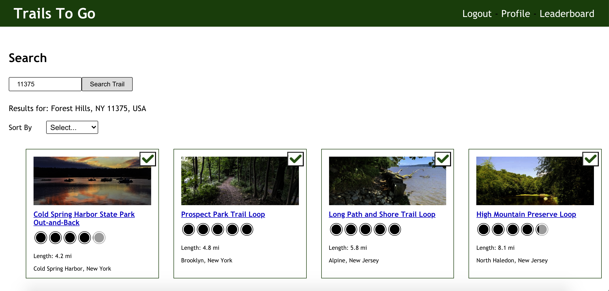
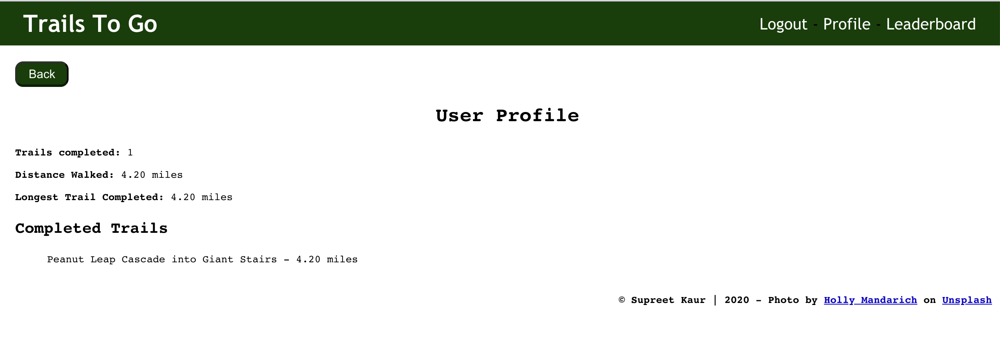
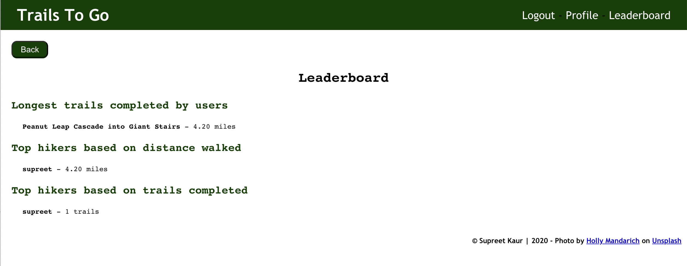

  # Trails To Go

  Where users can search for trails by zipcode and mark them as completed.
  
<a href="https://trails-to-go-client.mesupi.vercel.app/" target="_blank">Live Version</a>
  
  This repo contains the client-side React app. Looking for the back-end Trails-To-Go API? **[Click Here](https://github.com/supu4aqua/trails-to-go-server.git)**

## Introduction
Users can search for trails by zipcode and can also filter the list by trail rating or length.
Users can also register and mark a trail as completed after logging in.
User profile section shows the statistics based on the trails completed by the user.
Leaderboard shows the top hikers based on trails completed

## Screen Captures
#### Landing Page:


#### Search Trail:


#### User Profile:


#### Leaderboard: 



## Technology

### Front End
* [React](https://reactjs.org/)
    * [Create React App](https://reactjs.org/docs/create-a-new-react-app.html)
    * [React Router](https://reacttraining.com/react-router/)
* HTML5
* CSS3
    * [CSS Modules](https://github.com/css-modules/css-modules)

### Back End
* [Node](https://nodejs.org/en/) and [Express](https://expressjs.com/)
    * [Mocha](https://mochajs.org/) test framework and [Chai](http://www.chaijs.com/) assertion library
* [Postgres](https://www.postgresql.org)

### Testing
* [Jest](https://jestjs.io/en/)

### Production
* [Heroku](https://www.heroku.com/) Cloud Application Platform

## Client - Install and run locally
*** NOTE: The client makes AJAX calls to the [Trails To Go API](https://github.com/supu4aqua/trails-to-go-server.git), which should also be running in your development environment

* Clone this repository:
    * `git clone https://github.com/supu4aqua/trails-to-go-client.git`
* Move into folder:
    * `cd trails-to-go-client/`
* Run `npm install`
* Run `npm start`
* In browser, navigate to `localhost:3000` or your specified port
  
* To test, run `npm test`

## Server - Run Trail To Go API in a local development environment

### Prerequisites
* You will need these programs installed
    * [Git](https://git-scm.com/)
    * [Node.js](https://nodejs.org/en/)
    * [npm](https://www.npmjs.com/)
    * [Postgres](https://www.postgresql.org)
  
### Installation
* Clone this repository:
    * `git clone https://github.com/supu4aqua/trails-to-go-server.git`
* Move into folder:
    * `cd trails-to-go-server/`
* Run `npm install`

### Run Program
* Start PostgresSQL local server: `postgres`
* Run `npm start` (or `npm run dev` to run with nodemon which auto-restarts on save changes)
* Make requests using the root: `localhost:8080` or your specified port

### Test
* Start PostgresSQL local server
    * `postgres`
* Run `npm test`


## API Overview

## API

```
/api
.
├── /users
│   └── GET
│       ├── /
│   └── POST
│       └── /
├── /completed
│   └── GET
│       ├── /
│   └── POST
│       └── /
├── /leaderboard
│   └── GET
│       ├── /

```
## Future Features
* Show user completed trails as markers on Google Map in Profile section
* Allow user to search trails based on current location
* User should be allowed to add a rating
* User should be allowedto leave feedback or comments
* User should be able to post or share the completed trail details on Social Media
